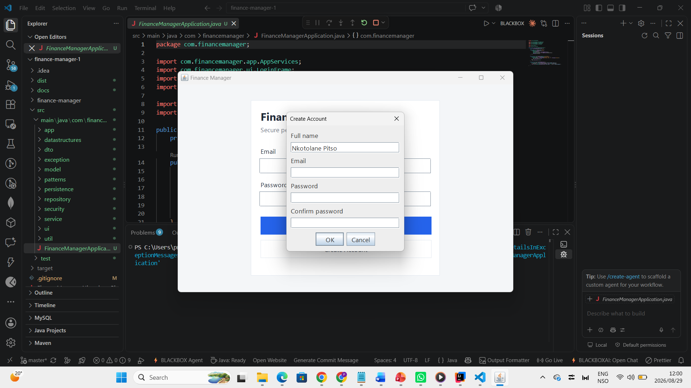
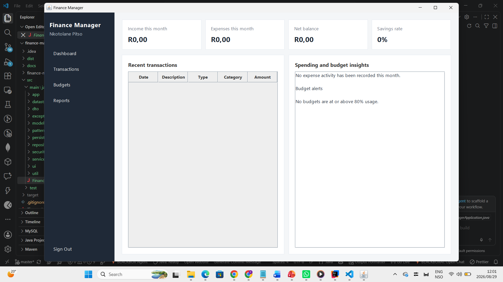
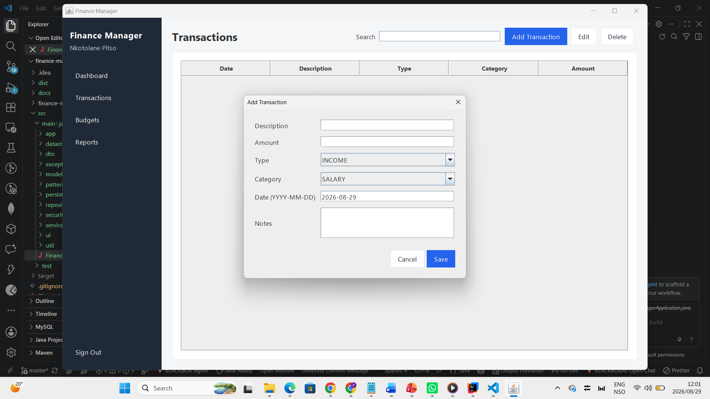
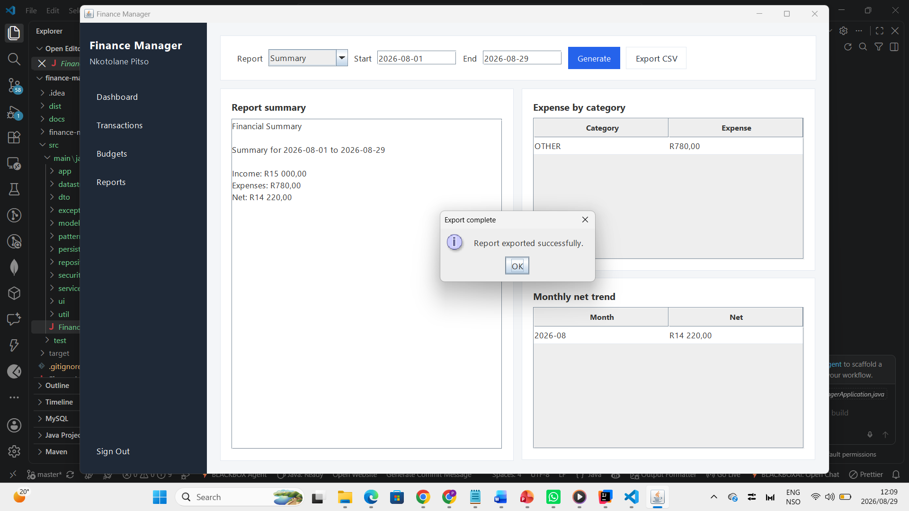
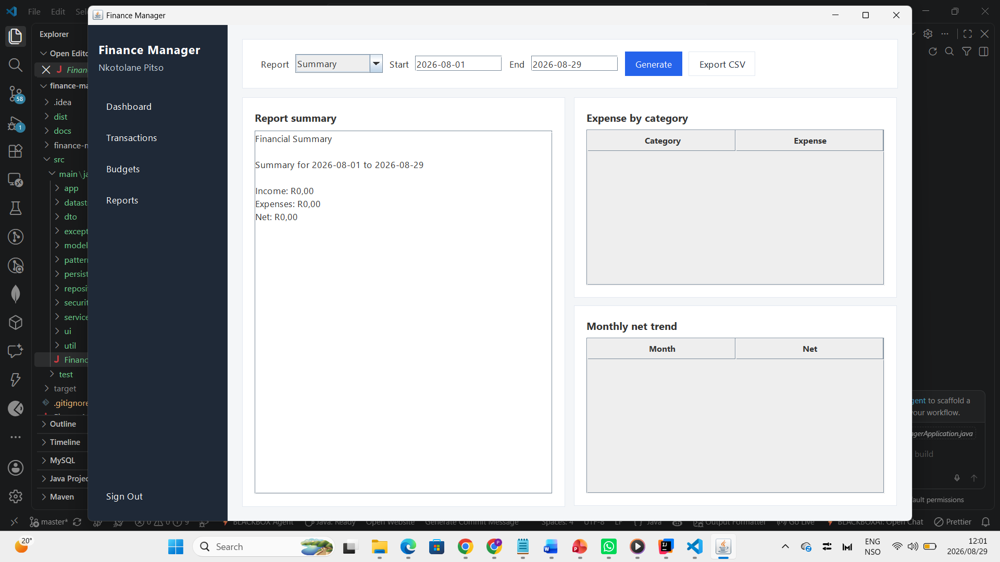
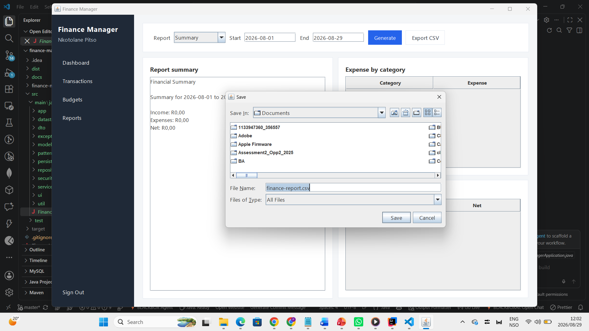
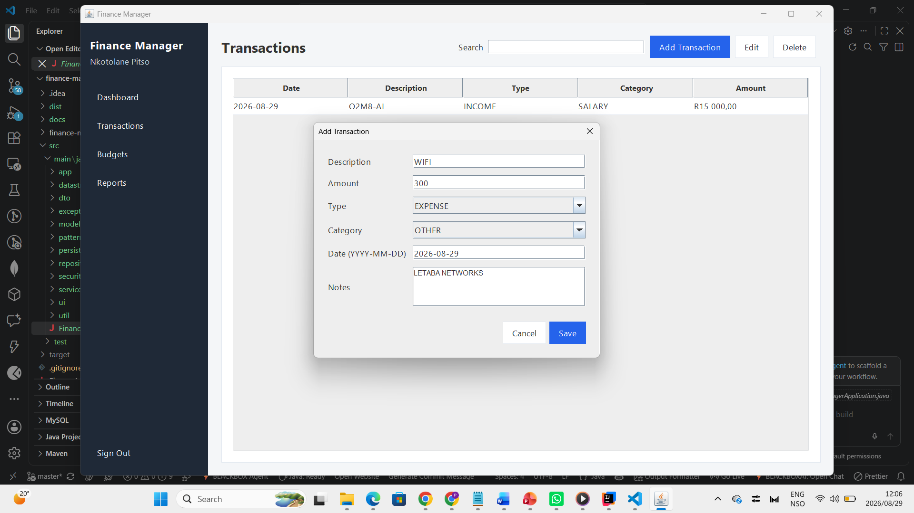

# Finance Manager Java Desktop

Finance Manager is a Java 21 desktop application for managing personal income, expenses, budgets, dashboard metrics, and financial reports.

## Download and deployment

Windows releases are generated automatically with GitHub Actions and `jpackage`. The release contains a native Windows installer with a bundled Java runtime plus a runnable JAR.

[Download the latest release](../../releases/latest)

To deploy a new release, push a version tag matching `pom.xml`, for example `v2.0.0`. See [`DEPLOYMENT.md`](DEPLOYMENT.md) for the complete commit and release workflow.

The application has been redesigned from a Spring Boot web project into a Java-only desktop architecture. The user interface is written with Java Swing and the backend is written with plain Java services, repositories, security utilities, design patterns, and custom data structures.

There is no HTML, CSS, JavaScript, Thymeleaf, Spring Boot, Lombok, JavaFX FXML, or external UI framework in the application source.

## Project goals

The project is designed to demonstrate software engineering rather than only CRUD functionality. It focuses on:

- Clear separation between presentation, business logic, persistence, and security.
- Java-only desktop development with Swing.
- SOLID-oriented class responsibilities.
- Explicit dependency construction instead of hidden framework dependency injection.
- Secure password storage using PBKDF2WithHmacSHA256.
- Atomic local persistence without requiring a database server.
- Custom data structures used for meaningful finance calculations.
- Observer and Strategy design patterns.
- Validation at the service boundary.
- User ownership checks for every transaction and budget operation.
- Testable business logic independent of the GUI.

## Technology

- Java 21
- Java Swing and AWT
- Java Serialization for local application state
- Java NIO for atomic file writes
- Java Cryptography Architecture for password hashing
- No runtime third-party libraries

Maven is included only as optional build metadata. The application can be compiled and packaged using only the JDK.

## Features

### Authentication

- Register a new account.
- Validate email and password rules.
- Hash passwords using PBKDF2 with a unique random salt.
- Sign in and sign out using an in-memory session.

### Dashboard

- Monthly income.
- Monthly expenses.
- Net balance.
- Savings rate.
- Five most recent transactions.
- Top expense categories.
- Budget warnings starting at 80 percent usage.

### Transactions

- Add income and expenses.
- Edit existing transactions.
- Delete transactions.
- Validate amount, date, transaction type, and category consistency.
- Restrict access to the signed-in user's records.

### Budgets

- Create monthly expense budgets by category.
- Edit and delete budgets.
- Prevent duplicate category budgets for the same month and year.
- Feed budget usage into the dashboard alert heap.

### Reports

- Financial Summary strategy.
- Expense Analysis strategy.
- Category expense breakdown.
- Monthly net trend.
- CSV export using Java NIO.

## Application screenshots

The screenshots below show the Java Swing desktop interface running from the project in Visual Studio Code. They demonstrate account registration, the dashboard, transaction management, reporting, and CSV export.

<table>
  <tr>
    <td width="50%" valign="top">
      <strong>Create account</strong><br><br>
      
    </td>
    <td width="50%" valign="top">
      <strong>Dashboard</strong><br><br>
      
    </td>
  </tr>
  <tr>
    <td width="50%" valign="top">
      <strong>Add transaction</strong><br><br>
      
    </td>
    <td width="50%" valign="top">
      <strong>Financial report and export confirmation</strong><br><br>
      
    </td>
  </tr>
  <tr>
    <td width="50%" valign="top">
      <strong>Reports workspace</strong><br><br>
      
    </td>
    <td width="50%" valign="top">
      <strong>CSV export</strong><br><br>
      
    </td>
  </tr>
</table>

<p align="center">
  <strong>Expense transaction entry</strong>
</p>
<p align="center">
  
</p>

## Architecture

```text
Swing UI
   |
   v
Application Services
   |
   +--> Security
   +--> Design Patterns
   +--> Custom Data Structures
   |
   v
Repositories
   |
   v
FileDataStore
   |
   v
finance-manager.dat
```

The GUI never reads or writes persistence data directly. UI classes call services. Services enforce validation and business rules. Repositories isolate storage access. `FileDataStore` provides locking and atomic writes.

Detailed architecture is documented in `docs/ARCHITECTURE.md`.

## Project structure

```text
src/main/java/com/financemanager
|-- FinanceManagerApplication.java
|-- app
|   `-- AppServices.java
|-- datastructures
|   |-- BudgetAlertHeap.java
|   |-- CategorySpendingMap.java
|   `-- TransactionLedger.java
|-- dto
|-- exception
|-- model
|-- patterns
|   |-- observer
|   `-- strategy
|-- persistence
|-- repository
|-- security
|-- service
|-- ui
|   |-- components
|   |-- dialogs
|   `-- panels
`-- util
```

## Run with the JDK only

Requirements:

- JDK 21 or newer

From the project root:

```bash
mkdir -p out/main
find src/main/java -name "*.java" > sources.txt
javac --release 21 -d out/main @sources.txt
java -cp out/main com.financemanager.FinanceManagerApplication
```

On Windows PowerShell:

```powershell
New-Item -ItemType Directory -Force out\main | Out-Null
Get-ChildItem -Recurse src\main\java -Filter *.java | ForEach-Object FullName | Set-Content sources.txt
javac --release 21 -d out\main '@sources.txt'
java -cp out\main com.financemanager.FinanceManagerApplication
```

For a one-command build on Windows PowerShell:

```powershell
.\scripts\build.ps1
```

Run the generated JAR with:

```powershell
.\scripts\run.ps1
```

The build script creates `dist/finance-manager-java.jar`. Generated build and installer files are intentionally excluded from Git and are published through GitHub Releases instead.

## Local data

By default the application stores data in:

```text
Windows: C:\Users\<username>\.finance-manager\
Linux:   /home/<username>/.finance-manager/
macOS:   /Users/<username>/.finance-manager/
```

Files:

- `finance-manager.dat` contains serialized application state.
- `audit.log` records transaction create, update, and delete events.

A different data directory can be supplied at runtime:

```bash
java -Dfinance.manager.data.dir=/path/to/data -jar dist/finance-manager-java.jar
```

## Testing

Tests deliberately avoid third-party testing libraries so the repository remains runtime-dependency-free.

Compile and run:

```bash
mkdir -p out/main out/test
find src/main/java -name "*.java" > main-sources.txt
javac --release 21 -d out/main @main-sources.txt
find src/test/java -name "*.java" > test-sources.txt
javac --release 21 -cp out/main -d out/test @test-sources.txt
java -ea -cp out/main:out/test com.financemanager.CoreSmokeTest
java -ea -cp out/main:out/test com.financemanager.ServiceIntegrationTest
```

## Engineering documentation

- `docs/ENGINEERING_PLAN.md` explains the redesign plan and technical decisions.
- `docs/ARCHITECTURE.md` documents layers, data flow, patterns, security, persistence, and performance.
- `docs/DEVELOPER_GUIDE.md` explains how another developer should extend and maintain the application.

## Automated build and release

- `.github/workflows/ci.yml` builds and tests every push and pull request to `main` or `master`.
- `.github/workflows/release.yml` creates a Windows installer when a matching `v*` tag is pushed.
- `scripts/build.ps1` builds and tests the project locally with only JDK 21.
- `scripts/package-windows.ps1` creates the Windows installer locally with `jpackage` and WiX Toolset 3.

Full deployment instructions are in [`DEPLOYMENT.md`](DEPLOYMENT.md).

## Production considerations

This design is intentionally optimized for a portfolio-quality local desktop application with no external runtime dependencies. For a multi-user enterprise deployment, replace `FileDataStore` with a relational database repository implementation, add database migrations, centralized identity, encrypted secrets, structured logging, automated JUnit tests, CI/CD, and application packaging/signing.
